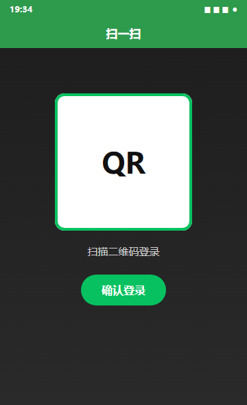
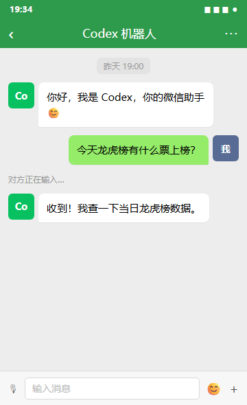
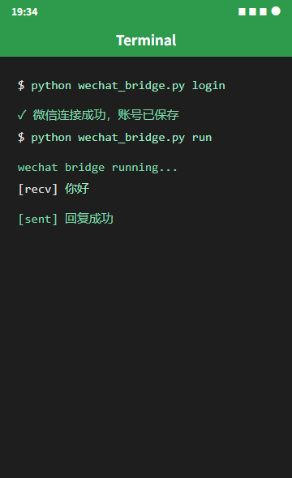

# codex-wechat-bridge-skill

Connect Codex to your personal WeChat (微信) account through Tencent's iLink Bot API. The bot uses
long-polling to receive your messages and replies by calling an LLM API directly — no public
endpoint, webhook, or per-message CLI process needed.

> ⚠️ This connects to a **personal WeChat** account via an iLink bot identity. It is **not** for
> WeCom (企业微信) or official-account publishing, and iLink bot accounts generally cannot receive
> ordinary group events (DMs only).

## Features

- QR-code login: scan with WeChat, the bridge saves your bot credentials automatically.
- Long-poll receive: no public endpoint or webhook required.
- Direct LLM reply: fast, no `codex exec` process startup per message.
- Context-token persistence: keeps reply continuity across restarts.
- Config-driven: all credentials live in a gitignored `config.json`.

## Requirements

- Python 3.10+
- `requests`
- A personal WeChat account on your phone
- A local LLM provider that exposes an OpenAI **Responses**-style API (`POST /responses`)

Install:

```bash
pip install requests
```

## 使用流程

<p align="center"></p>

1. **扫码登录**：运行 `login`，用微信「扫一扫」确认，保存 bot 凭据。
2. **收发消息**：在微信里给 bot 发消息，Codex 直接调用 LLM 回复。
3. **运行桥接**：`run` 常驻长轮询，自动回复。

```text
你(微信) ──> 微信 bot ──> wechat_bridge.py ──> LLM API ──> 回复回微信
```

对应命令：

```bash
python wechat_bridge.py login   # 第 1 步：扫码登录
python wechat_bridge.py run     # 第 2、3 步：常驻收发，自动回复
```

## Quick start

```bash
# 1. Copy the template and fill in your LLM provider details
cp config.example.json config.json
#    edit config.json -> llm_base_url / llm_model / llm_token

# 2. Log in by scanning a QR with WeChat
python scripts/wechat_bridge.py login

# 3. Run the bridge
python scripts/wechat_bridge.py run
```

`login` prints a QR link, waits for you to scan and confirm in WeChat, then saves the iLink bot
credentials (`account_id`, `token`, `home_channel`) back into `config.json`. You only do this once.

## Config

`config.example.json` (copy to `config.json`, which is gitignored):

```json
{
  "account_id": "<YOUR_ILINK_BOT_ACCOUNT_ID>",
  "token": "<YOUR_ILINK_BOT_TOKEN>",
  "base_url": "https://ilinkai.weixin.qq.com",
  "user_id": "",
  "home_channel": "",
  "llm_base_url": "<YOUR_LLM_RESPONSES_BASE_URL>",
  "llm_model": "<YOUR_LLM_MODEL>",
  "llm_token": "<YOUR_LLM_API_TOKEN>",
  "instructions_file": ""
}
```

- `account_id` / `token` / `home_channel`: filled automatically by `login`; do not hardcode them.
- `llm_base_url` / `llm_model` / `llm_token`: your model provider. `llm_base_url` should point to the
  OpenAI-compatible `/responses` endpoint root (e.g. `.../api/plan/v3`).
- `instructions_file` (optional): path to a text file whose contents are sent as the model's
  `instructions` on every reply — handy for shared persona/memory.

## Commands

| Command | Description |
|---|---|
| `login` | Request a QR, wait for scan, save iLink credentials |
| `poll` | Fetch new messages once and print them |
| `run` | Long-poll daemon; reply to each DM via the LLM API |
| `send "text"` | Send a text message to the configured home channel |

## How it works

- **Receive:** `POST ilink/bot/getupdates` with `get_updates_buf` long-polls for messages.
- **Reply:** `POST {llm_base_url}/responses` with `{model, input}`; optional `instructions` from
  `instructions_file`.
- **Send:** `POST ilink/bot/sendmessage`, echoing the peer's latest `context_token`.

Full protocol notes and known limitations live in [references/setup.md](references/setup.md).

## Security

- Never commit `config.json` or `state/` (both are gitignored).
- Keep your bot `account_id`, `token`, and provider addresses private.
- Anything the user writes to the bot is sent to your LLM provider — make sure that's acceptable.

## License

MIT
